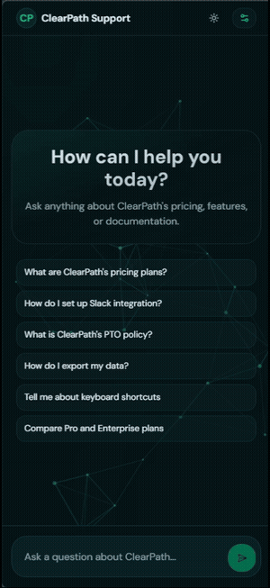

<p align="center">
  
  
  
  
  
  
  
</p>

# ClearPath RAG Chatbot

> A production-grade RAG system built entirely from scratch — no LangChain, no LlamaIndex, no vector databases, no RAG-as-a-service. Pure NumPy retrieval, deterministic routing, and a hand-built evaluation pipeline.

🔗 **Live Demo** : [clearpath-rag-873904783482.asia-south1.run.app](https://clearpath-rag-873904783482.asia-south1.run.app)

🎬 **Video Walkthrough** : [Watch on Google Drive](https://drive.google.com/file/d/1BqxGsXO4YLFc60RuJtFLts_Okb1F7hvq/view?usp=sharing)

---



## At a Glance

| Metric | Value |
|---|---|
| **Cold start** | 623ms (−98.8%) |
| **Docker image** | 666 MB (−67%) |
| **Eval pass rate** | **32/32** |
| **Chunks** | 93 (from 376) |
| **Injection defense** | **8/8** blocked |
| **Retrieval quality** | 0.73 avg (+30%) |
| **Embedding model** | 32 MB ONNX INT8 |
| **Decisions documented** | 30 |

<br clear="right"/>

---

## Why This Exists

Most RAG tutorials and projects plug together LangChain, ChromaDB, and OpenAI and call it a day. This project takes the opposite approach: **every component is built and understood from first principles.**

- **No abstraction layers**: The retrieval is 4 lines of NumPy. The router is a hand-tuned 7-signal scorer. The embedder runs on ONNX Runtime with manual mean pooling.
- **Every decision is documented**: 30 architectural choices, each with alternatives considered, pros/cons weighed, and empirical validation. Not "I used X because the tutorial said so" — actual comparative analysis.
- **Optimized, not just functional**: Three rounds of chunking iteration. Seven embedding models benchmarked on actual data (leaderboard rankings didn't predict real-world performance). Docker image size cut by 67%. Cold start reduced by 98.8%.
- **Adversarial testing**: The document corpus contains 4 deliberately embedded prompt injections. All blocked. Plus 3 novel attack patterns independently designed and tested.

The result is a system that handles a user question in under a second: retrieves relevant content from 30 documents, routes to the right model, generates a grounded answer, evaluates it for reliability, and streams it token-by-token — all with full observability.

> 📐 For the full technical deep-dive, see [ARCHITECTURE.md](docs/ARCHITECTURE.md). For key decision rationale, see [DECISIONS.md](docs/DECISIONS.md).

---

## What Makes This Different

| Capability | Typical RAG Project | This Project |
|---|---|---|
| **Embedding model** | Whatever the tutorial used | Benchmarked 7 models on actual chunks; BGE-small won by +30% |
| **Chunking** | Fixed 512-token splits | Structure-aware, FAQ-preserving, 3 iterations (376 → 93 chunks) |
| **Vector store** | ChromaDB / Pinecone | Pure NumPy dot-product — 4 lines of code, <1ms search |
| **Prompt injection defense** | None | Per-request salted XML tags + hardened system prompt (8/8 passing) |
| **Model routing** | LLM-based or single model | Deterministic 7-signal weighted scorer with empirical threshold tuning |
| **Deployment** | "Runs locally" | GCP Cloud Run, CI/CD with eval gate, 623ms cold start |
| **Model optimization** | PyTorch at 2 GB | ONNX INT8 quantization, 32 MB model, 666 MB Docker image |
| **Testing** | Manual or none | 32-test automated eval harness across 3 suites |
| **Conversation memory** | Raw history appending | Follow-up detection + query rewriting via LLM (+35% retrieval improvement) |

---

## How It Works

```
User Query
    │
    ▼
┌─────────────────────┐
│  Conversation Memory│ ── Follow-up? → Rewrite via 8B model
└─────────┬───────────┘
          ▼
┌─────────────────────┐
│    Model Router     │ ── 7-signal weighted scorer (deterministic)
│  threshold ≥ 4 → 70B│    Greeter detection bypasses both models
└─────────┬───────────┘
          ▼
┌─────────────────────┐
│  BGE-small Embedder │ ── ONNX INT8 (32MB) → 384-dim vector
│  + NumPy Retriever  │    top_k=5, threshold=0.25
└─────────┬───────────┘
          ▼
┌─────────────────────┐
│   Prompt Builder    │ ── Salted XML tags (per-request random salt)
│                     │    System prompt hardening against injection
└─────────┬───────────┘
          ▼
┌─────────────────────┐
│   Groq API (LLM)    │ ── 8B: simple queries + query rewriting
│                     │    70B: complex/analytical queries
└─────────┬───────────┘
          ▼
┌─────────────────────┐
│  Output Evaluator   │ ── no_context │ refusal │ conflicting_sources
└─────────┬───────────┘
          ▼
┌─────────────────────┐
│  Streaming SSE      │ ── Token-by-token to frontend
│  + Debug Metadata   │    Model, tokens, latency, flags, sources
└─────────────────────┘
```

---

## Features

### RAG Pipeline (From Scratch)

Extracts text from 30 PDFs (49 pages) using PyMuPDF, then chunks with structure awareness: section headings, paragraph boundaries, FAQ Q&A pair preservation (6 pairs detected), and table-aware merging with pricing tables given a higher token limit (500). The chunker was iterated 3 times (v1: 376 chunks → v2: 164 → **v3: 93 chunks**, avg 179 tokens) to minimize noise while preserving semantic coherence.

Embeddings use **BGE-small-en-v1.5** (33M params), selected by benchmarking 7 models on actual chunks — it outperformed models 10-17× its size. Running on **ONNX Runtime with INT8 quantization** (32MB), replacing the original PyTorch/sentence-transformers stack (~2GB). Retrieval is pure NumPy dot-product search with L2-normalized vectors.

### Deterministic Model Router

A 7-signal weighted scorer classifies each query as simple or complex: query length, analytical keywords, error keywords, negation, multi-entity detection, compound structure, and sensitive topics. Score ≥ 4 routes to `llama-3.3-70b-versatile`; below that, `llama-3.1-8b-instant`. Greetings are caught before the scorer and return a canned response with zero API calls.

Threshold was empirically validated: T=2 through T=5 tested against 30 queries. T=4 routes 17.2% to 70B — requiring at least two independent signal groups before escalating. If the 70B model hits rate limits, the system automatically falls back to 8B.

### Output Evaluator (3 Flags)

| Flag | Triggers When |
|---|---|
| `no_context` | LLM answered but zero chunks were retrieved (hallucination risk) |
| `refusal` | Answer matches one of 7 refusal patterns |
| `conflicting_sources` | Pricing contradictions detected across source documents |

The `conflicting_sources` flag uses three detection methods: model self-report keywords, numeric divergence across chunks from different documents, and known Pro plan price variant pairs ($49 / $45 / $52). Flags are surfaced in the UI as color-coded confidence badges.

### Prompt Injection Defense (8/8 Passing)

The document corpus contains 4 deliberately embedded prompt injections. All 4 are defeated, plus 3 novel attack patterns independently tested (instruction override, role-play jailbreak, system prompt extraction): **8/8 passing**.

The defense uses per-request salted XML context tags (`<ctx_{random_hex}>`) so pre-planted escape sequences can't guess the closing tag, combined with a hardened 7-rule system prompt that treats all context as untrusted data.

### Conversation Memory

In-memory turn history (last 5 turns per conversation) with follow-up detection via pronoun patterns, short-query heuristics, and 16 referring phrases. Detected follow-ups are rewritten into standalone questions by the 8B model before retrieval, improving relevance scores (e.g., "How much does it cost?" → resolves to ClearPath Pro plan pricing, retrieval score: 0.46 → 0.67).

### Token-by-Token Streaming

Server-Sent Events via `POST /query/stream`, with a final metadata event containing sources, flags, and telemetry. The frontend includes a stop button, automatic fallback to the non-streaming `/query` endpoint, and robust SSE buffer parsing that handles partial chunk boundaries.

### Frontend

React 18 + TypeScript + Vite with Tailwind CSS and 7 shadcn/ui components. Features a BioMed AI aesthetic (teal/emerald/slate palette, `DM Sans` + `Space Mono` typography), glassmorphism header, animated `@tsparticles` particle background, dark/light mode toggle, and mobile responsiveness.

8 custom components: `ChatArea` with auto-scroll, `MessageBubble` with markdown rendering and typing indicator, `SourceCard` with relevance scores, `ConfidenceIndicator` badges, `DebugPanel` sidebar (model, tokens, latency, flags, router signals), `InputArea` with dynamic textarea resizing and stop button, `SmartSuggestions` chips, and `ParticleBackground`.

---

## Eval Harness

Three test suites, **32/32 passing**:

```
Suite 1 : Content Retrieval    17/17 ✅
Suite 2 : Injection Defense     8/8  ✅
Suite 3 : Conversation Memory   7/7  ✅
────────────────────────────────────────
Total                          32/32 ✅
```

- **Content**: pricing, features, policies, API docs, edge cases, greetings, out-of-scope queries
- **Injection**: all 4 known PDF injections + 3 novel attacks (instruction override, role-play jailbreak, system prompt extraction)
- **Conversation**: pronoun resolution, topic continuity, 3-turn progressive drill-down

The eval runner (`eval_runner.py`) scores keyword relevancy, faithfulness, and flag accuracy. Runs as a **CI/CD quality gate** — every deploy must pass all 32 tests before going live.

```bash
cd tests
python eval_runner.py test_cases.json http://localhost:8000
python eval_runner.py test_injection_defense.json http://localhost:8000
python eval_runner.py test_conversation.json http://localhost:8000
```

---

## Deployment

### Live on GCP Cloud Run

Deployed to **asia-south1** (Mumbai) with automated CI/CD:

```
Push to main → GitHub Actions → Docker build → GCR push → Cloud Run deploy → Eval harness gate
```

The pipeline only triggers on changes to `backend/`, `frontend/`, or `Dockerfile`. Docker Buildx layer caching reuses unchanged layers across builds.

### Optimization Journey

| Metric | Before (PyTorch) | After (ONNX) | Change |
|---|---|---|---|
| Docker image | 2.01 GB | **666 MB** | −67% |
| Cold start | 52.4s | **623ms** | −98.8% |
| API latency (avg) | 652ms | **395ms** | −39% |
| pip install size | ~536 MB | ~148 MB | −72% |

---

## Quick Start

### Prerequisites

- Python 3.11+
- Node.js 20+
- [Groq API key](https://console.groq.com) (free, no credit card)

### Setup

```bash
git clone https://github.com/mist-ic/RAG-fromScratch.git
cd RAG-fromScratch

# Backend
cd backend
pip install -r requirements.txt
cd ..

# Frontend
cd frontend
npm install
cd ..

# Configure
cp backend/.env.example .env
# Edit .env: GROQ_API_KEY=gsk_your_key_here
```

### Run

```bash
# Terminal 1 : Backend
cd backend
python -m uvicorn app.main:app --port 8000

# Terminal 2 : Frontend
cd frontend
npm run dev
```

Open **http://localhost:5173**. First startup takes ~10-30s to embed all 30 PDFs; subsequent starts load from cache instantly.

### Docker

```bash
docker build -t clearpath-rag .
docker run -p 8080:8080 -e GROQ_API_KEY=your_key clearpath-rag
```

---

## API

| Method | Path | Description |
|---|---|---|
| `POST` | `/query` | Non-streaming query, returns full JSON response |
| `POST` | `/query/stream` | Streaming SSE, token-by-token with final metadata event |
| `GET` | `/health` | Health check : `{"status": "ok"}` |

See [API_CONTRACT.md](API_CONTRACT.md) for full request/response schemas.

### Environment Variables

| Variable | Required | Default | Description |
|---|---|---|---|
| `GROQ_API_KEY` | ✅ | | Groq API key |
| `PORT` | | `8000` | Backend server port |

---

## Project Structure

```
RAG-fromScratch/
├── .github/workflows/
│   └── deploy.yml              # CI/CD → Cloud Run + eval gate
├── assets/
│   ├── demo.mp4                # Demo video (vertical, 9.4s)
│   └── demo.gif                # Demo GIF for README
├── backend/
│   ├── app/
│   │   ├── main.py             # FastAPI app, routes, CORS, static serving
│   │   ├── config.py           # Pydantic settings, env vars, constants
│   │   ├── schemas.py          # Pydantic models (API contract)
│   │   ├── groq_client.py      # Groq SDK wrapper, streaming, retry
│   │   ├── logger.py           # Structured JSON logging (structlog)
│   │   ├── pipeline/
│   │   │   ├── extractor.py    # PDF text extraction (PyMuPDF)
│   │   │   ├── chunker.py      # Structure-aware paragraph chunking
│   │   │   ├── embedder.py     # ONNX Runtime embeddings + disk cache
│   │   │   ├── retriever.py    # NumPy dot-product retrieval
│   │   │   └── prompt.py       # Salted XML prompt builder
│   │   ├── router/
│   │   │   └── classifier.py   # 7-signal deterministic weighted scorer
│   │   ├── evaluator/
│   │   │   └── flags.py        # 3 flags: no_context, refusal, conflicting
│   │   └── memory/
│   │       └── conversation.py # In-memory turns + 8B query rewriting
│   ├── onnx_model/             # BGE-small-en-v1.5 ONNX INT8 (~32MB)
│   ├── index/                  # Auto-generated embedding cache
│   └── requirements.txt
├── frontend/
│   ├── src/
│   │   ├── App.tsx             # Main app with dark mode, layout
│   │   ├── components/         # ChatArea, MessageBubble, SourceCard,
│   │   │                       # DebugPanel, ConfidenceIndicator,
│   │   │                       # InputArea, SmartSuggestions,
│   │   │                       # ParticleBackground
│   │   └── hooks/
│   │       └── useStreamingChat.ts
│   └── vite.config.ts
├── tests/
│   ├── test_cases.json         # 17 content retrieval tests
│   ├── test_injection_defense.json  # 8 injection defense tests
│   ├── test_conversation.json  # 7 multi-turn conversation tests
│   └── eval_runner.py          # Test runner script
├── docs/
│   ├── ARCHITECTURE.md         # Technical deep-dive
│   ├── DECISIONS.md            # Top 10 architectural decision records
│   └── (30 ClearPath PDF documents)
├── Dockerfile                  # Multi-stage (node:20-slim + python:3.11-slim)
├── ENGINEERING_NOTES.md        # Routing logic, retrieval analysis, cost projections
├── CHANGELOG.md                # Optimization journey
└── README.md
```

---

## Known Limitations

1. **Nuanced intent routing**: "The timeline view isn't loading" (5 words, score 2) routes to 8B but ideally needs 70B cross-document reasoning. A learned classifier would fix this.

2. **In-memory conversation state**: Conversations are lost on restart. Production would need Redis or a database.

3. **Groq free-tier rate limits**: 70B capped at 1,000 RPD / 30 RPM. Under load, falls back to 8B automatically.

4. **Table extraction fidelity**: Complex PDF tables with merged cells may not chunk optimally due to PyMuPDF's text-based extraction.

---

📐 **[Architecture Deep-Dive →](docs/ARCHITECTURE.md)** · **[Decision Records →](docs/DECISIONS.md)** · **[Engineering Notes →](ENGINEERING_NOTES.md)** · **[Changelog →](CHANGELOG.md)**
